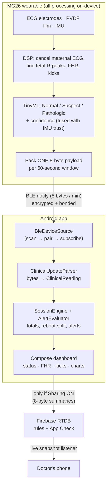
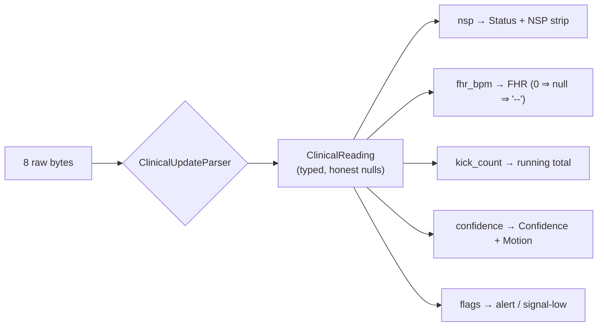
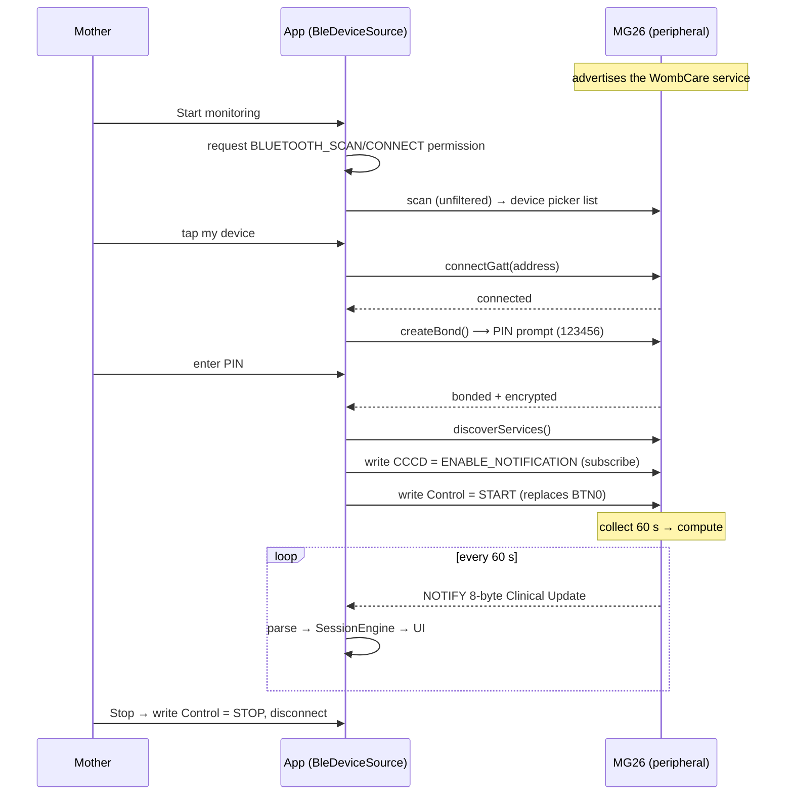
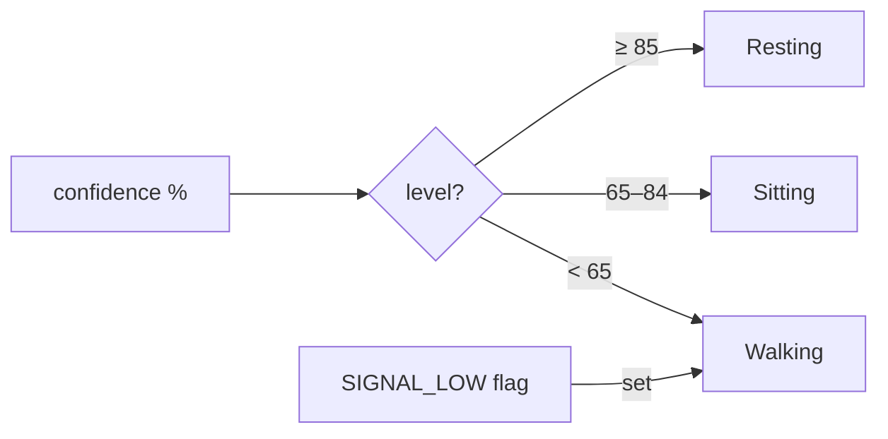
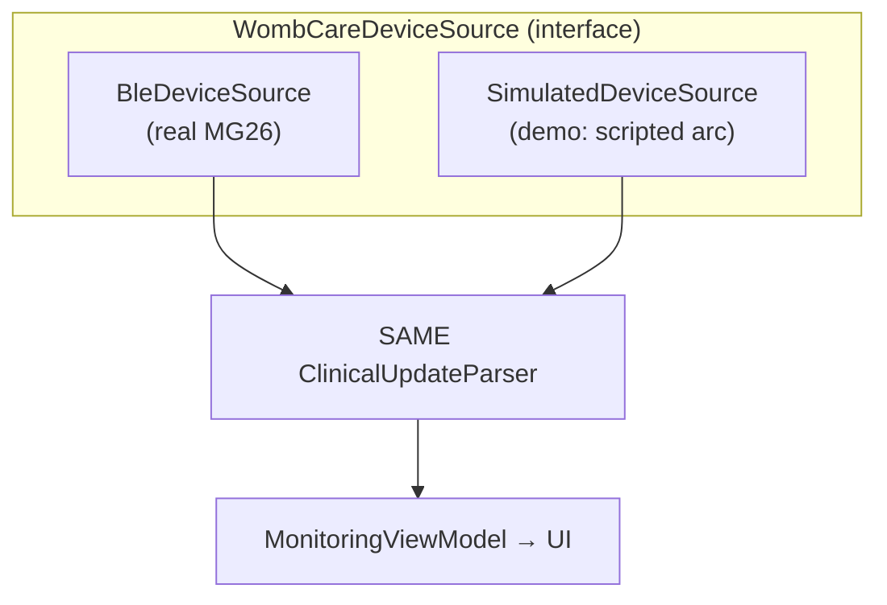

# WombCare — How It Works (Architecture)

How a signal on the mother's belly becomes a number on a phone — and how the app's BLE
framework connects, pairs, subscribes, decodes, and displays it. Diagrams render on GitHub.

---

## 1. End-to-end data flow

**Key idea:** the wearable does all the thinking and sends a tiny 8-byte *answer* once a
minute. Raw ECG/IMU never leave the device. The phone decodes, displays, and (only if the
mother enables sharing) forwards the summary to her doctor.

---

## 2. The 8-byte payload → what each byte means → where it shows

Little-endian, packed. Ground truth: [`BLE_CONTRACT.md`](BLE_CONTRACT.md).

| Byte | Field | Meaning | Where it appears in the app |
|---|---|---|---|
| 0 | `version` | 1 (or 2) | Chooses the decode layout; unknown → "update app" |
| 1 | `nsp` | 0 Normal · 1 Suspect · 2 Pathologic | **Status hero** + **NSP timeline strip** colour + **AlertEvaluator** |
| 2 | `confidence` | 0–100 % (ML × IMU trust) | **Confidence tile**; **Motion tile** (derived); alert signal-gating |
| 3 | `fhr_bpm` | bpm; **0 = no lock** | **FHR tile** (`--` if 0) + **FHR trend chart** (line breaks on 0) |
| 4 | `kick_count` | kicks **this window** | **Kicks tile** (app keeps the running total) + **kick bars** |
| 5 | `flags` | bit0 ALERT · bit1 SIGNAL_LOW · bit2 ACTIVE | ALERT→banner; SIGNAL_LOW→dim confidence + force "Walking" |
| 6–7 | `timestamp` | u16 LE, device minutes since boot | Session ordering + **reboot detection** (backwards jump ⇒ new session) |
| 8* | `motion_state` | v2 only: 0/1/2 Rest/Sit/Walk | **Motion tile** (if absent, derived from `confidence`) |
| 9* | `battery_pct` | v2 only: 0–100 | **Battery card** (or the standard Battery Service 0x2A19) |

\* bytes 8–9 exist only in payload v2. Today the firmware sends v1 + battery via the standard
Battery Service; Motion is inferred from `confidence` (see §4).

Two decode rules that matter: `fhr_bpm == 0` becomes `null` (renders `--`, never `0`, and
never drags a chart/average down); and a **backwards `timestamp`** means the device rebooted,
so the app starts a fresh session instead of stitching old and new data together.

---

## 3. The BLE framework — connect, pair, subscribe, receive

This is the standard BLE-central pattern every such app (nRF Connect, the Si Labs app,
watch apps) follows. WombCare's `BleDeviceSource` implements exactly this.

**Pairing/PIN lifecycle** (matches Si Connect): the PIN is entered **once**, during bond
establishment, and the bond persists — reconnects are silent. To be asked again, the mother
uses **Settings → Forget device**, which removes the bond (`removeBond`) so the next connect
re-pairs. This is why "connect once, then can't re-enter the PIN" needed the Forget action.

**Notifications:** the app explicitly subscribes by writing `ENABLE_NOTIFICATION_VALUE` to the
Clinical Update characteristic's CCCD (0x2902) — the standard GATT subscription. If nothing
arrives after connecting, the *device* isn't sending yet (sensors not started, or <60 s), not
a subscription problem.

---

## 4. How "Motion" works without a motion byte

The v1 payload has no motion field, and sending raw IMU would cost extra bytes. But
`confidence` already encodes IMU trust (movement lowers it), so the app **infers motion from
confidence** on the phone:

If firmware later sends an explicit motion byte (v2), that takes precedence. (Approximate —
confidence also drops on genuine ML uncertainty — but zero extra bytes on the wire.)

---

## 5. Two sources, one interface

Both the real device and the demo simulator emit readings through the **same parser** — so
demo mode exercises production decode code, and the UI can't tell which it's talking to.
Demo mode needs no Bluetooth (great for showing the whole app with no hardware).

---

## 6. Where each concern lives

| Concern | Lives in |
|---|---|
| Scan / connect / bond / subscribe / decode | `core/device/BleDeviceSource.kt`, `core/ble/ClinicalUpdateParser.kt` |
| Byte↔meaning contract | `docs/BLE_CONTRACT.md`, `core/ble/WombCareGatt.kt` |
| Session totals, reboot split, alert gating | `core/device/SessionEngine.kt`, `AlertEvaluator.kt` |
| Cloud sync + security | `core/data/*`, `database.rules.json` |
| Firmware (device side) | `Wombcare_6PreFinal/` — `wombcare_ble.c`, `app.c`, GATT config |
